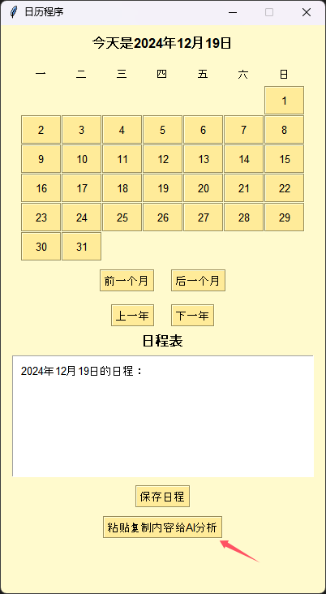

## ctrl-c_calendar


**ctrl-c_calendar** 是一个基于LLM的便捷生成日程工具，特点是简洁易用、一目了然，同时AI赋能。

## 环境配置

首先克隆本仓库。

```bash
git clone https://github.com/gitveg/ctrl-c_calendar.git
```

然后安装依赖
```bash
pip install -r requirements.txt
```

启动程序
```bash
python calendar.py
```

## 使用方法

复制一段带有日程信息的文字，然后点击"粘贴复制内容给AI分析"，AI会自动分析判断是否生成日程表。



<!--  -->
